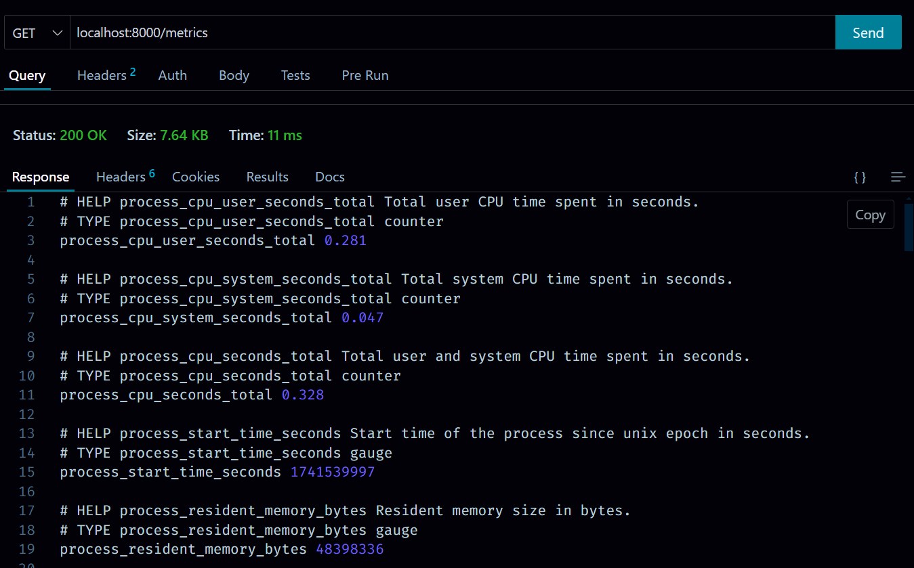
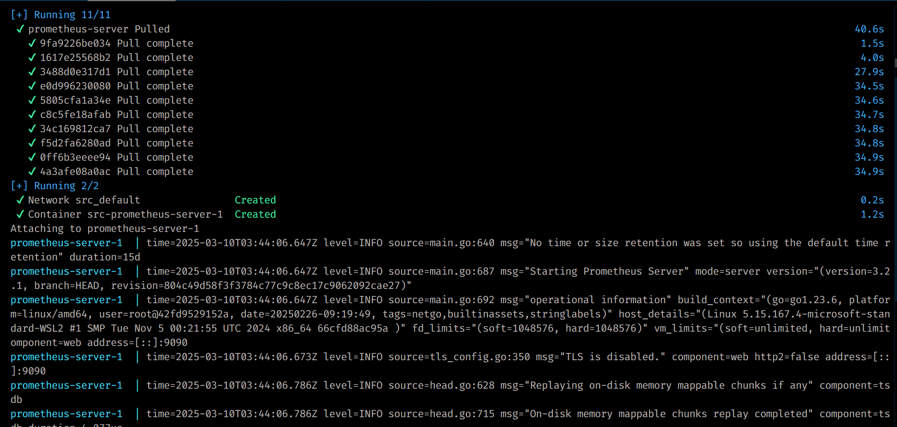
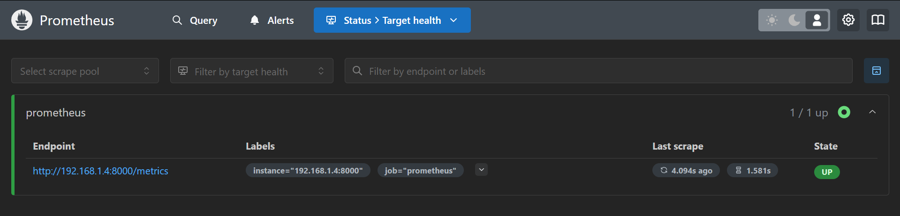
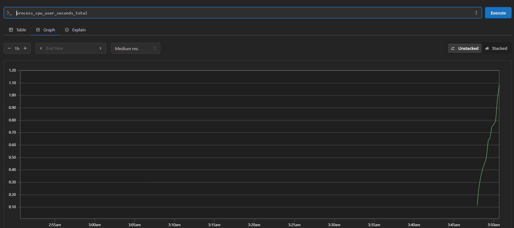
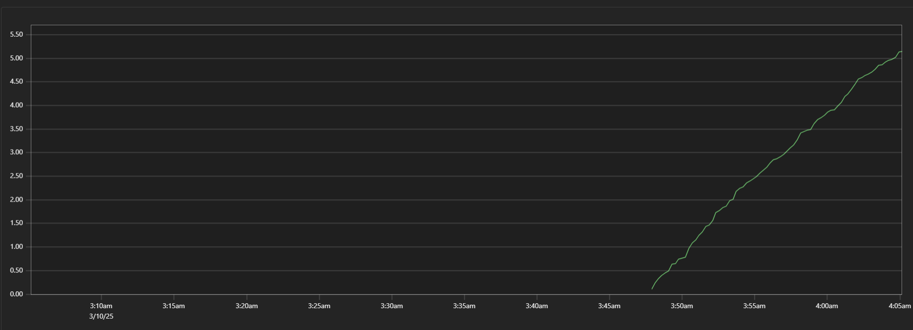
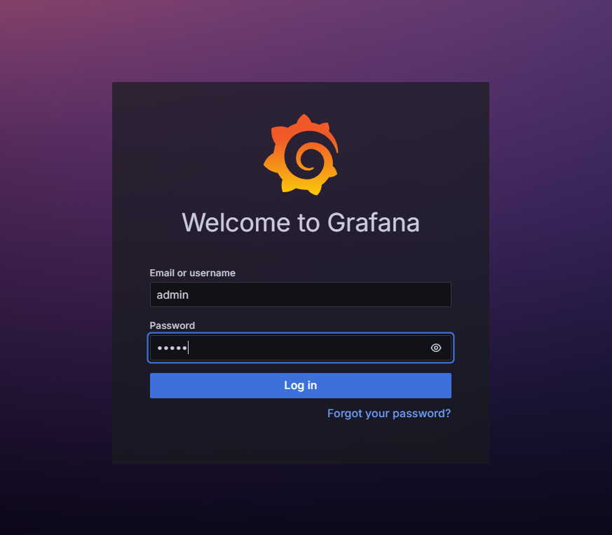
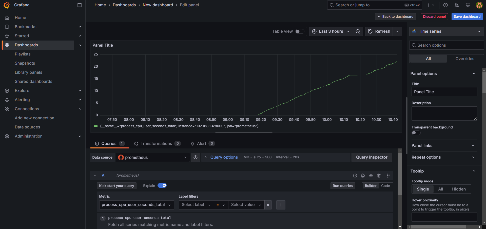
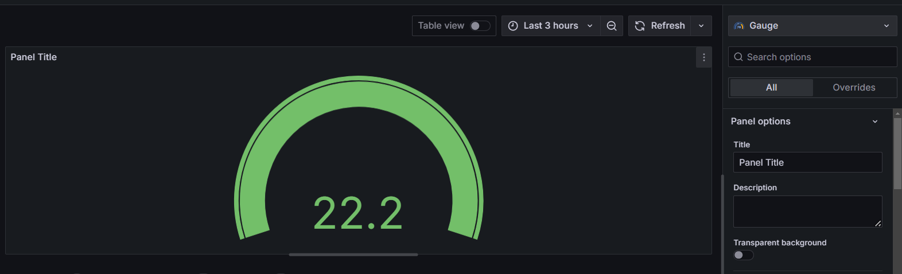
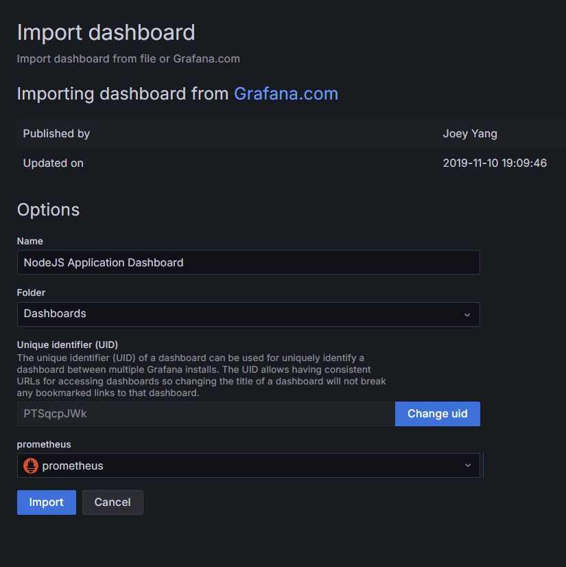
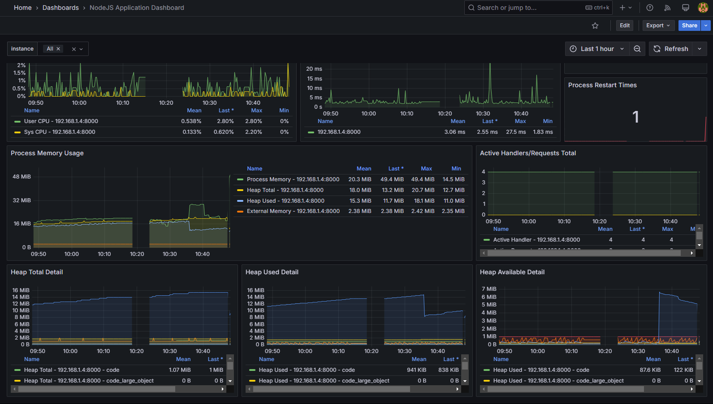

# Prometheus, Grafana, and Loki: Building a Central Monitoring System

## Monitoring = Metrics + Logs + Alerts

This project demonstrates how to set up a comprehensive monitoring and observability stack using three powerful open-source tools:

### Components

- **Prometheus**: An open-source monitoring and alerting toolkit designed for reliability and scalability.

     - Collects and stores metrics as time-series data
     - Features a flexible query language (PromQL)
     - Supports multiple modes of graphing and dashboarding

- **Grafana**: A multi-platform open-source analytics and interactive visualization web application.

     - Creates customizable dashboards
     - Visualizes metrics from various data sources
     - Provides alerting capabilities

- **Loki**: A horizontally scalable, highly available log aggregation system.
     - Designed to be cost-effective
     - Uses labels for indexing (similar to Prometheus)
     - Doesn't index the contents of logs

### Architecture Overview

```
┌─────────────┐     ┌─────────────┐     ┌─────────────┐
│ Applications │────►│ Prometheus/ │────►│   Grafana   │
│ & Services   │     │    Loki     │     │ Dashboards  │
└─────────────┘     └─────────────┘     └─────────────┘
         Expose          Collect and         Visualize and
         Metrics         Store Data          Alert
```

This stack provides a complete observability solution, capturing both metrics and logs for comprehensive system monitoring.

### Setup

## 1. Install Prometheus Client on the server to collect metrics.

```bash
npm i prom-client
```

## 2. Initiate the client in your application.

```javascript
const client = require("prom-client");

const collectDefaultMetrics = client.collectDefaultMetrics;
collectDefaultMetrics({ register: client.register });
```

## 3. Create a route to expose metrics.

```javascript
app.get("/metrics", (req, res) => {
	res.set("Content-Type", client.register.contentType);
	res.end(client.register.metrics());
});
```

## 4. Run the server

```bash
npm run dev
```




## 5. Run the Prometheus server

- Pull the logs from localhost:8000/metrics every 5 seconds

```bash
touch prometheus.yml
```

- Search your PRIVATE IP by running:

```bash
ifconfig # linux/mac
ipconfig # windows
```

```yml
global:
        scrape_interval: 5s

scrape_configs:
        - job_name: "prometheus"
          static_configs:
                  - targets: [<PRIVATE_IP>:8000]
```

## 6. Crete a docker-compose.yml file and run it.

```yml
version: "3.7"

services:
        prom-server:
                image: prom/prometheus
                volumes:
                        - ./prometheus.yml:/etc/prometheus/prometheus.yml
                ports:
                        - 9090:9090
```

```bash
docker-compose up
```



Visit the Prometheus dashboard at:

```bash
localhost:9090
```



Hit as many requests as you can to see the metrics increasing in 5-10 seconds.
The CPU User seconds increases suddenly.


As time passes, it becomes less steeper since no new requests are being made.


# Grafana 🔥

#### Let's visualize the metrics in Grafana. It interacts with Prometheus to fetch the metrics and create charts, dashboards, and alerts.

```bash
docker run -d -p 3000:3000 --name=grafana_dashboard grafana/grafana-oss
```

Enter Username and Password as `admin`.

## 7. Set up Grafana with Prometheus

1. Start the Grafana.
   `bash
docker run -d -p 3000:3000 --name=grafana_dashboard grafana/grafana-oss
`
2. Login to Grafana - Open your browser and go to `http://localhost:3000` - Use `admin` for both username and password - You'll be prompted to change the password on first login

3. Connect Prometheus as a data source - Click on "Create your first dashboard" - Select "Add a new Data Source" - Choose "Prometheus" - Enter your Prometheus server URL (`http://<PRIVATE_IP>:9090`) - Save and test the connection

4. Create your first dashboard - Click "Create Dashboard" - Add panels to visualize your metrics



- Using Gauge
  

- Import Ready made Grafana Dashboard from https://grafana.com/grafana/dashboards/11159-nodejs-application-dashboard/



# Dashboard for Node.js Application


